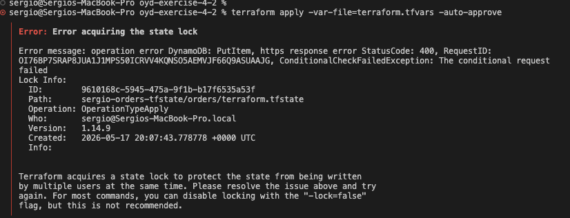

# Task 5 — Evidence

This document contains the required evidence demonstrating the successful Terraform state migration to a remote Amazon S3 backend and lock contention validation.

## Evidence

### Remote Terraform State

Command executed:

```bash
terraform state list
```

Source: [state-remote.txt](./state-remote.txt)

Output:

```text
oyd-exercise-4-2 % terraform state list

aws_s3_bucket.order_attachments
time_sleep.lock_demo
```

---

### S3 Backend State File

Command executed:

```bash
aws s3 ls s3://sergio-orders-tfstate/orders/
```

Source: [s3-state.txt](./s3-state.txt)

Output:

```text
aws s3 ls s3://sergio-orders-tfstate/orders/

2026-05-17 14:08:08       3447 terraform.tfstate
```

---

### Lock Contention Screenshot

Source: [lock-contention.png](./lock-contention.png)

The following screenshot shows Terraform lock contention during concurrent state operations:

